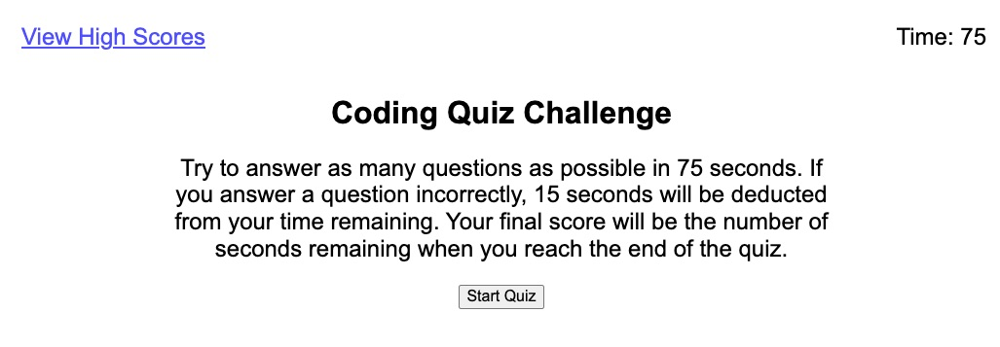

# Timed Coding Quiz

## Description

This quiz was built to help developers test their knowledge in preparation for coding interviews. By practicing with this timed quiz, developers can become more comfortable with a type of assessment they might be faced with when applying for jobs.

## Installation

N/A

## Usage

View the [deployed application](https://sendusyourbones.github.io/coding-quiz/).

- Review the instructions for the quiz
- Click "Start Quiz" to begin the quiz, note the timer at the top of the page
- When presented with each question, select the answer you think is correct
- At the end of the quiz, enter your initials and click "Submit" to store your score
- To view high scores at any time, click "View High Scores" at the top of the page
- To clear the high scores, click "Clear Scores"
- When viewing the high scores, to restart the quiz, click "Go Back"

## Credits

I obtained my CSS reset file from GitHub user [necolas](github.com/necolas/normalize.css).

## License

MIT License